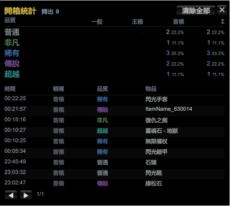
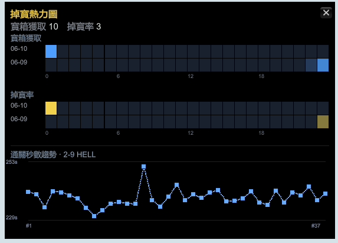
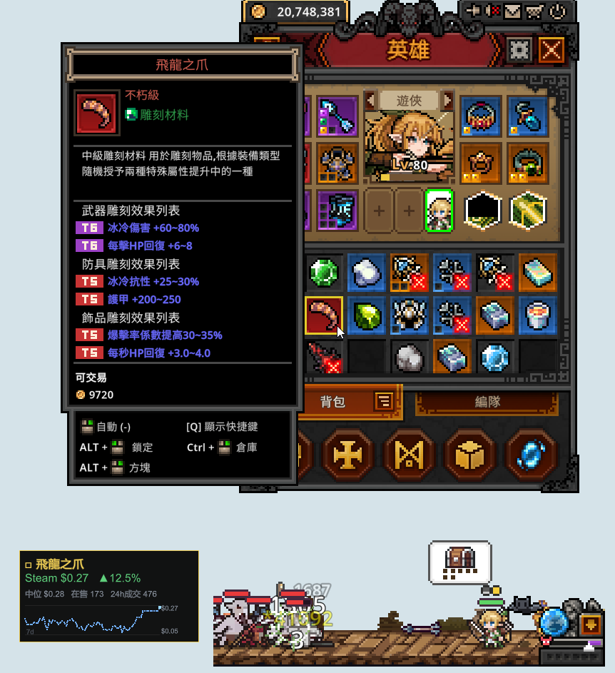
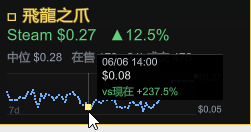
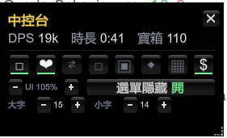

# TBH DPS Meter

[English](README.md) · **日本語** · [繁體中文](README.zh-Hant.md) · [简体中文](README.zh-Hans.md)

**TaskBarHero**（TBH: Task Bar Hero）向けのゲーム内 **DPS / 被ダメージ / ステージ比較 / 周回効率プランナー / 宝箱ログ / 開封統計 / ドロップ分布 / Steam マーケット価格チェック** オーバーレイ。すべて **F1 コントロール（コントロールセンター）** から表示切替できます。
BepInEx 6 IL2CPP プラグインとして実装。動作確認バージョン **v1.00.09**（Unity 6 / IL2CPP）。
UI は **English / 日本語 / 繁體中文 / 简体中文 / Español** を自動判別します。

> ⬇️ **プレイヤーの方は [Releases](../../releases/latest) の zip をダウンロードするだけでOK。ビルド不要です。**


<table>
<tr>
<td></td>
<td></td>
</tr>
<tr>
<td align="center"><b>DPSパネル</b>（与ダメージ）</td>
<td align="center"><b>被ダメージパネル</b>（受けたダメージ）</td>
</tr>
</table>

---

## 表示内容

**DPSパネル:**
- リアルタイムDPS（5秒スライディングウィンドウ）+ ピーク + 平均
- 総ダメージ + 戦闘時間 + ウェーブ数
- ダメージタイプ別内訳（近接 / 投射 / 範囲 / 召喚 / 継続 / 罠、複合フラグ対応）
- 会心率 + 会心ダメージ割合

**被ダメージパネル:**
- リアルタイムDTPS（毎秒被ダメージ）+ ピーク + 平均
- 総被ダメージ + 時間 + 最大単発被弾
- **被弾**（攻撃を受けた回数）+ **被会心**（敵があなたに与えた会心率）
- 2本の分布バー：属性（物理/火/氷/雷/混沌）とダメージタイプ

## ステージ比較（F11）
**F11** で**ステージ比較パネル**を開きます：保存した記録を**ステージ（難易度別）**にまとめ、今回の記録を**基準**
（既定は最速クリア、または手動で固定した記録）と比較し、時間・**有効出力 vs 停止（移動）時間**・
平均/ピーク/会心・ステータス・ダメージ配分%・**波別時間**に加えて、**パーティ各キャラの完全な装備構成**：
装備中の**ギア**（アイテム名＋アフィックス）と**スキル**（レベル付き）を表示し、基準との差分を色分けします。
上部にはクリア秒数の推移グラフ（点をクリックでその記録の詳細）。◀ ▶ で記録切替、≪ ≫ でステージ切替、キャラタブで英雄切替、固定ボタンで基準設定。

ステージ名・キャラ・スキル・**アイテム**名は**ゲーム内の言語に追従**します——ゲームを English / 日本語 / 繁體中文 / 简体中文 / Español に切り替えると、パネルも**即座に切り替わります（再起動不要）**。


> *上部にクリア秒数の推移グラフ（点をクリックでその記録の詳細）。下部は「基準 ∣ 今回」を揃えた2列で表示し、緑/赤で変化を示し、そのキャラの装備とスキルも併記。*

## 周回効率プランナー（F6）
**F6** で、全ステージを対象にあなた専用の「どこを周回すべき？」ランキングを表示します——gold/秒 と exp/秒 を並べて表示し、並べ替え可能、難易度フィルターチップ付き。静的な wiki の表とは違い、あなた自身のビルドに合わせて較正されます：
- クリア済みのステージは、あなたの実測値を使用（緑、Real）。
- 未クリアのステージは、wiki のベースライン × あなた個人の倍率（あなたの周回から学習）を使い、クリア時間は実測の周回からのフィッティング（time = perHP·HP + perWave·waves）で算出——Est. と表示。
- **EXP維持率%** 列はゲーム内のレベルペナルティ（あなたのレベル vs ステージのレベル）を反映するため、レベルが高すぎる／低すぎるステージも正直にランク付けされます——高いステージが常に良いとは限りません。
- **ビルド認識:** 各周回はフィンガープリント化（ギア＋アフィックス＋スキル＋レベル）され、現在のビルドの周回のみが較正に算入されます。ギアを変更すると自動検知し、再クリアを促します。

「basis」行は較正が何に基づいているか（周回数、ステージ数、レベル、現在 vs 旧ビルド）を示します。


> *全ステージをあなたの実測 gold/秒 & exp/秒 でランク付け。緑＝実測、グレー＝推定。維持 列はゲーム内の EXP 維持率ペナルティ。*

## 宝箱ログ（F5）
**F5** で**宝箱ログ**を開きます：宝箱の取得を**時刻 · ステージ · 名前**で記録。**Stage Boss Box（ボス箱）**
は**青字**で表示し**別途集計**、ステージ別の個数と1時間あたりの個数も表示します。取得ごとに**通知音**が
鳴ります —— **⚙ 設定**から オン/オフ、**音量**調整、**試聴**、自分の **.wav** の指定が可能（既定は内蔵の2音チャイム）。


> *各宝箱を時刻・ステージ・名前で記録。Stage Boss Box は青字で別カウント。*

## 開封統計（F4）
**F4** で**開封統計**を開きます —— ボックスを開けて実際に何が出たか。累計の集計から、**グレード × 種類**の
マトリクス（回数と%）でボックス種類ごとのレア度分布を表示し（どのボックスを開ける価値があるかが分かります）、
時系列でページ送りできる**開封ログ**も併記します。



## ドロップ分布（F3）
**F3** で**ドロップ分布**を開きます —— *いつ*ドロップしたかを可視化する、2段に重ねた**曜日 × 24時間**のグリッド：
上=**ボックス取得**（F5 のログ準拠、青）、下=**レジェンダリー以上の開封**（F4 から、グレード≥3、金緑）、
側面にサマリー行付き。下部の**クリア秒数の推移**グラフは、F11 比較パネルで現在選択中のステージに追従するため、
*いつ周回したか* と *どれだけ速くクリアしていたか* を並べて確認できます。



## Steam マーケット価格チェック
アイテムにカーソルを合わせると ——**バックパック**、報酬ポップアップ、ツールチップが出る場所ならどこでも ——
その **Steam コミュニティマーケット**価格を小さなボックスで表示します：現在価格、**24h 変動**、**中央値**販売価格、
**出品数**、**24h 取引量**、そして **7日間の価格カーブ**。価格は約30分ごとに更新される cron ベースのフィードから取得し、
プレイヤーごとのスクレイピングは不要です。アイテムを**右クリック**するとボックスをそのアイテムに**ピン留め**でき ——
ピン後はボックスが固定され、カーソルをカーブ上に移動して任意の点にホバーすると、その点の**時刻 · 価格 · 現在との変化**が表示されます。
**F4** で位置調整モードに入りボックスをドラッグできます。F1 コントロールセンターから表示切替できます。

<table>
<tr>
<td></td>
<td></td>
</tr>
<tr>
<td align="center"><b>任意のアイテムにホバー</b>で Steam マーケット価格</td>
<td align="center"><b>ピン留め＋カーブにホバー</b>で各日の価格を確認</td>
</tr>
</table>

## コントロール（F1）
**F1** で**コントロールセンター**を開きます —— **すべて**のパネルをトグルボタンとして一覧する、ひとつのコンパクトな
ハブ（点灯=表示中、暗=非表示）。ホットキーを覚えなくても、DPS・被ダメージ・ステージ比較・周回効率プランナー・
ボックスログ・開封統計・ドロップ分布 の表示/非表示をひとつの場所から切り替えられます。上部には小さなライブ要約
（**DPS · セッション時間 · 開封数**）を表示。起動時にデフォルトで表示され、新しいパネルは自動的に登録されます。
下部の行はグローバル設定です：**UI スケール**、**メニュー時に隠す**、そして 2 つの独立した**フォントサイズ**ステッパー ——
**大（大きい）**はタイトル・主要な数値・リスト行、**小（小さい）**は補助テキスト・軸ラベル・ボタンを制御 —— 全パネルに即時適用されます。



## 表示スケール
小さい画面や低解像度では、パネルが画面からはみ出さないよう**自動で縮小**します。F1 コントロールセンターの
**− UI % +** か **Ctrl + PageUp / PageDown** で手動指定も可能 —— 全パネルに適用され、`UI.UIScale` に保存されます。
その隣にテキスト自体を制御する 2 つの独立した**フォントサイズ**ステッパー（**大** / **小**）があり、`UI.FontSize` と `UI.FontSizeSmall` に保存されます。


## 操作
- **F1** — コントロールセンター／ハブの表示/非表示（設定可：`HubUI.ToggleKey`）
- **F9** — DPSパネルの表示/非表示（設定可：`ToggleKey`）
- **F10** — 被ダメージパネルの表示/非表示（設定可：`TakenUI.ToggleKey`）
- **F11** — ステージ比較パネルの表示/非表示（設定可：`CompareUI.ToggleKey`）
- **F6** — 周回効率プランナーの表示/非表示（設定可：`FarmUI.ToggleKey`）
- **F5** — 宝箱ログの表示/非表示（設定可：`BoxUI.ToggleKey`）
- **F7** — 開封統計パネルの表示/非表示（設定可：`BoxOpenUI.ToggleKey`）
- **F3** — ドロップ分布の表示/非表示（設定可：`LootMapUI.ToggleKey`）
- **F4** — 価格ボックスの位置調整（ドラッグ）モードに入る（設定可：`Price.AdjustKey`）
- **アイテムを右クリック** — 価格ボックスをピン留め／解除（ピン後はカーブにホバーして各日を確認）
- **マウスドラッグ** — パネルの移動（位置は個別に自動保存、画面外には出ません）
- 右上の **リセット** ボタンでゼロに、**◀ ▶** で過去ステージの記録を閲覧
- **PageUp / PageDown** — パネルの透明度調整；**Ctrl + PageUp / PageDown** — 全パネルのスケール調整

> ⚠️ クリックはゲーム側に**貫通**します（プラグインはマウスを読み取るだけで入力を奪いません）。パネルをクリックしてもキャラが動くのは正常な挙動です。

---

## インストール

### A. 初回インストール（BepInEx 未導入）
1. **[Releases](../../releases/latest)** から `TBH-DpsMeter-vX.Y.Z.zip` をダウンロード。
2. Steam → 「TBH: Task Bar Hero」を右クリック → 管理 → ローカルファイルを閲覧
   （`TaskBarHero.exe` が見えるフォルダ）。
3. zip 内の**すべてのファイル**をそのフォルダへ解凍し、`winhttp.dll`・`doorstop_config.ini`・
   `dotnet`・`BepInEx` を `TaskBarHero.exe` と**同じ階層**に置く（上書きを聞かれたら「はい」）。
4. **必ず Steam から起動**してください（exe を直接実行するとプラグインが読み込まれません）。
5. 初回起動は 1～3 分ほど黒画面になります（一度きりの初期化）。以降は通常通りです。

### B. プラグインの更新（導入済みの場合）
**はい、更新は DLL 1ファイルの差し替えだけでOKです。** BepInEx 本体はそのままで構いません。

新しい `TBH.DpsMeter.dll` を以下に上書き：
```
<ゲームフォルダ>\BepInEx\plugins\TBH.DpsMeter.dll
```
> 上書き前に**ゲームを完全に終了**してください（起動中は DLL がロックされ上書きできません）。その後 Steam から再起動します。

---

## 設定
ファイル：`<ゲームフォルダ>\BepInEx\config\tbh.dpsmeter.cfg`（初回起動後に生成）
```
[General]
Language = Auto   # zh-Hant / zh-Hans / en / ja / es に変更で言語を固定
```

## アンインストール
ゲームフォルダから次を削除：`winhttp.dll`・`doorstop_config.ini`・`.doorstop_version`・
`dotnet\`・`BepInEx\`。これで完全にバニラ状態へ戻ります。

---

## ソースからのビルド（開発者向け）
```
dotnet build DpsMeter/DpsMeter.csproj -c Release
# 出力：DpsMeter\bin\Release\TBH.DpsMeter.dll
copy DpsMeter\bin\Release\TBH.DpsMeter.dll  <ゲーム>\BepInEx\plugins\
```
ゲームは **Steam 経由**で再起動してください（この Unity 6 ビルドでは exe 直接起動だと
BepInEx の winhttp プロキシが注入されません）。

### 仕組み
- **与ダメージ:** `TaskbarHero.Monster.ebj(DamageInfo, bool)` への Harmony postfix。
  `Unit.b_isHero` でプレイヤー側ヒットに絞り、`OriginDamage` / `IsCritical` / `DamageType` を読み取り。
- **被ダメージ:** `TaskbarHero.Hero.ebj(DamageInfo, bool)` への Harmony postfix。攻撃者がヒーロー以外の
  ヒットを計上し、`OriginDamage` / `IsCritical` / `DamageType` / `DamageAttribute` を読み取り。
- **ウェーブ境界:** `StageManager.stageState`（MONSTERSPAWN → BATTLE → REORGANIZATION）をポーリング。
  MONSTERSPAWN ごとにリセット、REORGANIZATION で凍結。
- DPS / DTPS の計算は純粋な C# の `DpsTracker` / `DamageTakenTracker`（`TrackerTests` でユニットテスト済み）。

---

## ⚠️ 免責事項
本プラグインは BepInEx で注入し、ダメージデータを**読み取るのみ**で、ゲームの数値を一切改変せず、
本作はシングルプレイです。とはいえ、**いかなるサードパーティMod／インジェクションツールも、ゲームや
プラットフォーム（Steam等）の利用規約に違反する可能性があり**、アカウント停止・セーブ破損・その他の
損失のリスクを伴います。

**本ソフトの使用はすべて自己責任です。** 本プラグインの使用に起因するアカウントの BAN・停止・データ消失・
その他の直接的または間接的損害について、作者は**一切責任を負いません**。この条件に同意できない場合は使用しないでください。

## ライセンス
[MIT](LICENSE) © 2026 WarmBed
