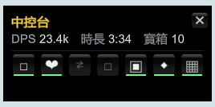

# TBH DPS Meter

**English** · [日本語](README.ja.md) · [繁體中文](README.zh-Hant.md) · [简体中文](README.zh-Hans.md)

In-game overlay for **TaskBarHero** (TBH: Task Bar Hero) — **DPS · damage-taken · stage-compare ·
farming-planner · box-log · opened-box stats · loot-heatmap**, all toggled from an **F1 control center**.
Built as a BepInEx 6 IL2CPP plugin. Tested on game **v1.00.09** (Unity 6 / IL2CPP).
UI auto-detects **English / 日本語 / 繁體中文 / 简体中文 / Español**.

> ⬇️ **Players: just download the zip from [Releases](../../releases/latest) — no compiling needed.**

> 🌐 **Website:** https://tbh-dps-meter.zeabur.app


<table>
<tr>
<td></td>
<td></td>
</tr>
<tr>
<td align="center"><b>DPS panel</b> (damage you deal)</td>
<td align="center"><b>Damage-taken panel</b> (damage you receive)</td>
</tr>
</table>

---

## What it shows

**DPS panel:**
- Live DPS (5s sliding window) + Peak + Average
- Total damage + encounter duration + wave count
- Damage-type breakdown (melee / projectile / area / summon / DoT / trap, with combined flags)
- Crit rate + crit-damage share

**Damage-taken panel:**
- Live DTPS (damage per second taken) + Peak + Average
- Total taken + duration + biggest single hit
- **Hits** (times you were hit) + **incoming crit** (monsters' crit rate against you)
- Two distribution bars: element attribute (physical/fire/ice/lightning/chaos) and damage type

## Stage Compare (F11)
Press **F11** to open the **stage-compare panel**: it groups your saved runs by stage (per difficulty)
and shows the current run against a **baseline** (fastest clear by default, or a run you pin), with
deltas for duration, **active vs idle (running) time**, avg/peak/crit, attributes, damage distribution
and **per-wave times** — plus the **full per-character loadout**: equipped **gear** (with item names &
affixes) and **skills** (with levels), per party member, highlighting what changed vs the baseline.
A clear-time trend chart sits on top; click a point to inspect that run. Use ◀ ▶ to browse runs,
≪ ≫ to switch stages, the character tabs to switch hero, and the pin button to set a baseline.

Stage / character / skill / item names follow the **in-game language** — set the game to English /
日本語 / 繁體中文 / 简体中文 / Español and the panel switches live (no restart needed).


> *Clear-time trend on top (click a point to inspect that run); below, **baseline ∣ this run** in aligned columns with green/red deltas, plus the character's gear & skills.*

## Farming Planner (F6)
Press **F6** for a **personalized** "what should I farm?" ranking of every stage — **gold/sec** and
**exp/sec** side by side, sortable, with difficulty filter chips. Unlike a static wiki table, it is
calibrated to **your own build**:
- Stages you've cleared use your **real measured** numbers (green, `Real`).
- Stages you haven't use the wiki baseline × **your personal multiplier** (learned from your runs),
  with the clear time fit from your measured runs (`time = perHP·HP + perWave·waves`) — marked `Est.`.
- An **EXP-retention %** column reflects the in-game level penalty (your level vs the stage level),
  so over-/under-leveled stages are ranked honestly — higher stage ≠ always better.
- **Build-aware:** each run is fingerprinted (gear + affixes + skills + level); only runs from your
  **current build** count toward calibration. Change gear and it auto-detects, prompting a re-clear.

A **basis** line shows what the calibration rests on (runs · stages · level · current vs old build).


> *Every stage ranked by your real gold/sec & exp/sec; green = measured, grey = estimated from your personal multiplier; the **Keep** column is the in-game EXP-retention penalty.*

## Box Log (F5)
Press **F5** for the **treasure-box log**: every box pickup recorded with **time · stage · box name**.
**Stage Boss Boxes** show in **blue** and get their own **boss-box tally**, alongside per-stage counts
and a boxes-per-hour rate. A **sound** plays on every pickup — open the **⚙ settings** to toggle it,
adjust the **volume**, **test** it, or choose your own **.wav** (a built-in two-note chime by default).


> *Each box logged with time, stage and name; Stage Boss Boxes in blue with a separate tally.*

## Opened-box Stats (F4)
Press **F4** for **opened-box stats** — what you actually *pull* when you open boxes. A **grade × box-kind
matrix** (count and %) over your lifetime tally shows the rarity distribution per box type (so you can see
which boxes are worth opening), alongside a paged, time-ordered **open log**.


## Loot Heatmap (F3)
Press **F3** for the **loot heatmap** — two stacked **day × 24-hour** grids that reveal *when* your loot
happens: the top grid = **box pickups** (mirrors the F5 log, blue), the bottom = **legendary-or-better opens**
(from F4, grade ≥ 3, gold-green), with a summary row on the side. A **clear-time trend** chart at the bottom
follows whichever stage is currently selected in the F11 compare panel, so you can line up *when you grinded*
against *how fast you were clearing*.


## Control Center (F1)
Press **F1** for the **control center** — one compact hub that lists **every** panel as a toggle button
(lit when shown, dim when hidden), so you can flip DPS, damage-taken, compare, planner, box-log, opened-box
and loot-heatmap on/off from a single place instead of memorizing every hotkey. A tiny live summary
(**DPS · session time · boxes opened**) sits at the top. Shown on launch by default; new panels register
themselves automatically.



## Display scaling
Panels **auto-shrink** so they never run off the screen on small or low-resolution displays. Set your own
size with the **− UI % +** control on the DPS panel's title row, or **Ctrl + PageUp / PageDown** — applied
to every panel and saved as `UI.UIScale`.


## Controls
- **F1** — toggle the control center / hub (configurable: `HubUI.ToggleKey`)
- **F9** — toggle the DPS panel (configurable: `ToggleKey`)
- **F10** — toggle the damage-taken panel (configurable: `TakenUI.ToggleKey`)
- **F11** — toggle the stage-compare panel (configurable: `CompareUI.ToggleKey`)
- **F6** — toggle the farming planner (configurable: `FarmUI.ToggleKey`)
- **F5** — toggle the box log (configurable: `BoxUI.ToggleKey`)
- **F4** — toggle the opened-box stats panel (configurable: `BoxOpenUI.ToggleKey`)
- **F3** — toggle the loot heatmap (configurable: `LootMapUI.ToggleKey`)
- **Mouse drag** — move a panel (positions saved independently)
- **Reset** button (top-right) zeroes the meter; **◀ ▶** browse past-stage records
- **PageUp / PageDown** — adjust panel opacity; **Ctrl + PageUp / PageDown** — scale all panels

> ⚠️ Clicks **pass through** to the game (the plugin only reads the mouse, it does not capture input), so your character still acts when you click on a panel. This is expected.

---

## Install

### A. First-time install (BepInEx not yet installed)
1. Download `TBH-DpsMeter-vX.Y.Z.zip` from **[Releases](../../releases/latest)**.
2. Steam → right-click **"TBH: Task Bar Hero"** → Manage → Browse local files
   (you should see `TaskBarHero.exe`).
3. Extract **ALL** files from the zip into that folder so `winhttp.dll`,
   `doorstop_config.ini`, `dotnet`, and `BepInEx` sit **next to** `TaskBarHero.exe`
   (choose "Yes" to overwrite if asked).
4. **Launch through Steam** (launching the exe directly will NOT load the plugin).
5. First launch shows a black screen for 1–3 minutes (one-time setup). Then it's normal.

### B. Updating the plugin (already installed before)
**Yes — updating only needs the single DLL.** BepInEx itself stays untouched.

Overwrite the new `TBH.DpsMeter.dll` into:
```
<game folder>\BepInEx\plugins\TBH.DpsMeter.dll
```
> **Close the game completely first** — while it is running the DLL is locked and cannot be overwritten. Relaunch through Steam afterward.

---

## Config
File: `<game folder>\BepInEx\config\tbh.dpsmeter.cfg` (created after the first run)
```
[General]
Language = Auto   # force a language: zh-Hant / zh-Hans / en / ja / es
```

## Uninstall
Delete from the game folder: `winhttp.dll`, `doorstop_config.ini`, `.doorstop_version`,
`dotnet\`, and `BepInEx\`. This fully restores the vanilla game.

---

## Build from source (developers)
```
dotnet build DpsMeter/DpsMeter.csproj -c Release
# output: DpsMeter\bin\Release\TBH.DpsMeter.dll
copy DpsMeter\bin\Release\TBH.DpsMeter.dll  <game>\BepInEx\plugins\
```
Restart the game **through Steam** (on this Unity 6 build, launching the exe directly
does not inject the BepInEx winhttp proxy).

### How it works
- **Damage dealt:** Harmony postfix on `TaskbarHero.Monster.ebj(DamageInfo, bool)`,
  filtered to player-side hits via `Unit.b_isHero`; reads `OriginDamage` / `IsCritical` / `DamageType`.
- **Damage taken:** Harmony postfix on `TaskbarHero.Hero.ebj(DamageInfo, bool)`, counting any
  hit whose attacker is not a hero; reads `OriginDamage` / `IsCritical` / `DamageType` / `DamageAttribute`.
- **Wave boundaries:** polls `StageManager.stageState` (MONSTERSPAWN → BATTLE → REORGANIZATION);
  resets each MONSTERSPAWN, freezes at REORGANIZATION.
- DPS / DTPS math lives in pure-C# `DpsTracker` / `DamageTakenTracker`, unit-tested in `TrackerTests`.

---

## ⚠️ Disclaimer
This plugin injects via BepInEx, **only reads** damage data, does not modify any game value,
and the game is single-player. Nevertheless, **any third-party mod / injection tool may violate
the game's or platform's (e.g. Steam) Terms of Service** and carries a risk of account ban,
save corruption, or other loss.

**You use this software entirely at your own risk.** The author is **not liable** for any account
ban, suspension, data loss, or other direct or indirect damages arising from use of this plugin.
If you do not accept these terms, do not use it.

## License
[MIT](LICENSE) © 2026 WarmBed
