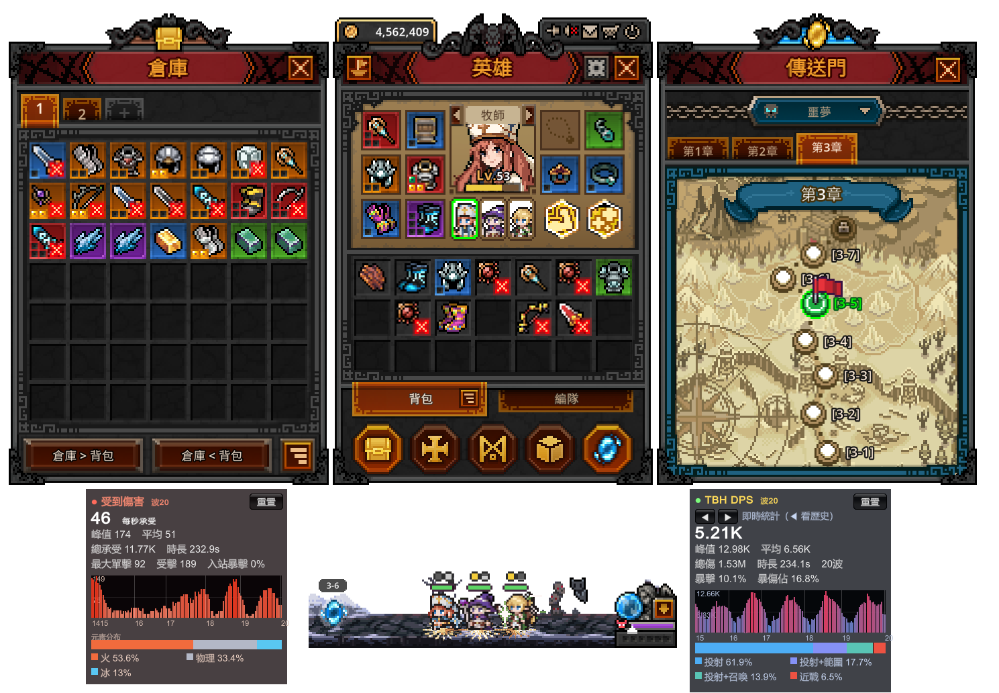

# TBH DPS Meter

**English** · [日本語](README.ja.md) · [繁體中文](README.zh-Hant.md)

In-game **DPS / damage-taken** overlay for **TaskBarHero** (TBH: Task Bar Hero),
built as a BepInEx 6 IL2CPP plugin. Tested on game **v1.00.09** (Unity 6 / IL2CPP).
UI auto-detects **English / 日本語 / 繁體中文**.

> ⬇️ **Players: just download the zip from [Releases](../../releases/latest) — no compiling needed.**



<table>
<tr>
<td></td>
<td></td>
</tr>
<tr>
<td align="center"><b>DPS panel</b> (damage you deal)</td>
<td align="center"><b>Damage-taken panel</b> (damage you receive)</td>
</tr>
</table>

---

## What it shows

**DPS panel:**
- Live DPS (5s sliding window) + Peak + Average
- Total damage + encounter duration + wave count
- Damage-type breakdown (melee / projectile / area / summon / DoT / trap, with combined flags)
- Crit rate + crit-damage share

**Damage-taken panel:**
- Live DTPS (damage per second taken) + Peak + Average
- Total taken + duration + biggest single hit
- **Hits** (times you were hit) + **incoming crit** (monsters' crit rate against you)
- Two distribution bars: element attribute (physical/fire/ice/lightning/chaos) and damage type

## Controls
- **F9** — toggle the DPS panel (configurable: `ToggleKey`)
- **F10** — toggle the damage-taken panel (configurable: `TakenUI.ToggleKey`)
- **Mouse drag** — move a panel (positions saved independently)
- **Reset** button (top-right) zeroes the meter; **◀ ▶** browse past-stage records
- **PageUp / PageDown** — adjust panel opacity (shared by both panels)

> ⚠️ Clicks **pass through** to the game (the plugin only reads the mouse, it does not capture input), so your character still acts when you click on a panel. This is expected.

---

## Install

### A. First-time install (BepInEx not yet installed)
1. Download `TBH-DpsMeter-vX.Y.Z.zip` from **[Releases](../../releases/latest)**.
2. Steam → right-click **"TBH: Task Bar Hero"** → Manage → Browse local files
   (you should see `TaskBarHero.exe`).
3. Extract **ALL** files from the zip into that folder so `winhttp.dll`,
   `doorstop_config.ini`, `dotnet`, and `BepInEx` sit **next to** `TaskBarHero.exe`
   (choose "Yes" to overwrite if asked).
4. **Launch through Steam** (launching the exe directly will NOT load the plugin).
5. First launch shows a black screen for 1–3 minutes (one-time setup). Then it's normal.

### B. Updating the plugin (already installed before)
**Yes — updating only needs the single DLL.** BepInEx itself stays untouched.

Overwrite the new `TBH.DpsMeter.dll` into:
```
<game folder>\BepInEx\plugins\TBH.DpsMeter.dll
```
> **Close the game completely first** — while it is running the DLL is locked and cannot be overwritten. Relaunch through Steam afterward.

---

## Config
File: `<game folder>\BepInEx\config\tbh.dpsmeter.cfg` (created after the first run)
```
[General]
Language = Auto   # set to zh-Hant / en / ja to force a language
```

## Uninstall
Delete from the game folder: `winhttp.dll`, `doorstop_config.ini`, `.doorstop_version`,
`dotnet\`, and `BepInEx\`. This fully restores the vanilla game.

---

## Build from source (developers)
```
dotnet build DpsMeter/DpsMeter.csproj -c Release
# output: DpsMeter\bin\Release\TBH.DpsMeter.dll
copy DpsMeter\bin\Release\TBH.DpsMeter.dll  <game>\BepInEx\plugins\
```
Restart the game **through Steam** (on this Unity 6 build, launching the exe directly
does not inject the BepInEx winhttp proxy).

### How it works
- **Damage dealt:** Harmony postfix on `TaskbarHero.Monster.ebj(DamageInfo, bool)`,
  filtered to player-side hits via `Unit.b_isHero`; reads `OriginDamage` / `IsCritical` / `DamageType`.
- **Damage taken:** Harmony postfix on `TaskbarHero.Hero.ebj(DamageInfo, bool)`, counting any
  hit whose attacker is not a hero; reads `OriginDamage` / `IsCritical` / `DamageType` / `DamageAttribute`.
- **Wave boundaries:** polls `StageManager.stageState` (MONSTERSPAWN → BATTLE → REORGANIZATION);
  resets each MONSTERSPAWN, freezes at REORGANIZATION.
- DPS / DTPS math lives in pure-C# `DpsTracker` / `DamageTakenTracker`, unit-tested in `TrackerTests`.

---

## ⚠️ Disclaimer
This plugin injects via BepInEx, **only reads** damage data, does not modify any game value,
and the game is single-player. Nevertheless, **any third-party mod / injection tool may violate
the game's or platform's (e.g. Steam) Terms of Service** and carries a risk of account ban,
save corruption, or other loss.

**You use this software entirely at your own risk.** The author is **not liable** for any account
ban, suspension, data loss, or other direct or indirect damages arising from use of this plugin.
If you do not accept these terms, do not use it.

## License
[MIT](LICENSE) © 2026 WarmBed
