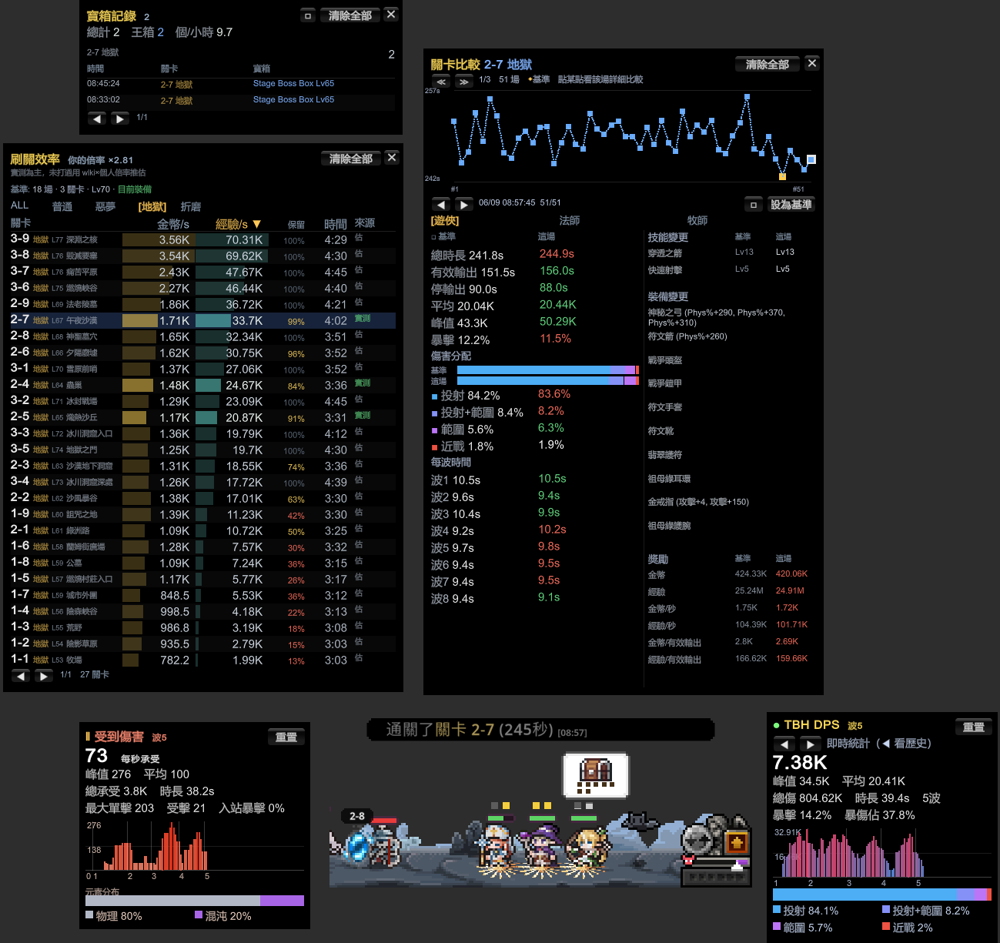
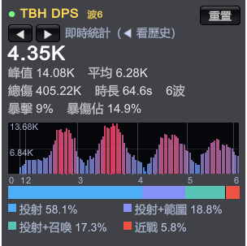
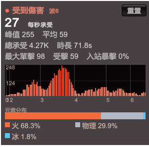
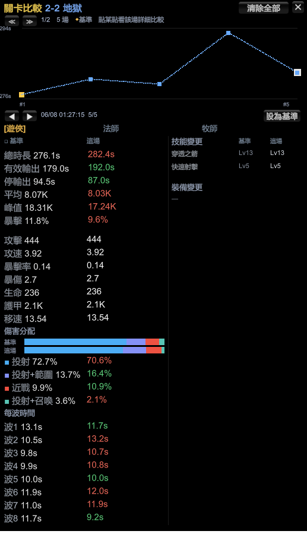
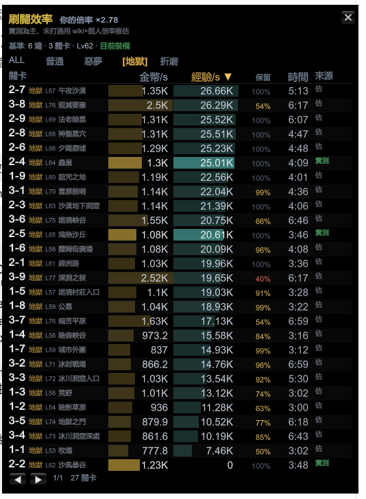
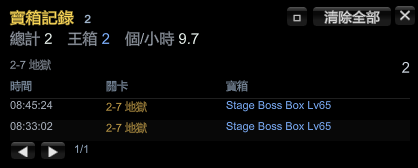
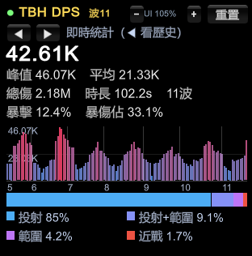

# TBH DPS Meter

[English](README.md) · [日本語](README.ja.md) · [繁體中文](README.zh-Hant.md) · **简体中文**

**TaskBarHero**（TBH: Task Bar Hero）的游戏内 **DPS / 承受伤害 / 关卡比较 / 刷关效率 / 宝箱记录** 监控插件，
以 BepInEx 6 IL2CPP 插件实现。测试版本 **v1.00.09**（Unity 6 / IL2CPP）。
界面自动检测 **繁體中文 / 简体中文 / English / 日本語 / Español**。

> ⬇️ **普通玩家只要到 [Releases](../../releases/latest) 下载 zip 就能用，不用编译。**



<table>
<tr>
<td></td>
<td></td>
</tr>
<tr>
<td align="center"><b>DPS 面板</b>（你造成的伤害）</td>
<td align="center"><b>承受伤害面板</b>（你受到的伤害）</td>
</tr>
</table>

---

## 显示内容

**DPS 面板:**
- 实时 DPS（5 秒滑动窗口）+ 峰值 + 平均
- 总伤害 + 战斗时长 + 波数
- 伤害类型分布（近战 / 投射 / 范围 / 召唤 / 持续 / 陷阱，含复合标记）
- 暴击率 + 暴伤占比

**承受伤害面板:**
- 实时 DTPS（每秒承受）+ 峰值 + 平均
- 总承受 + 时长 + 最大单次受击
- **受击**（被打中的次数）+ **入站暴击**（怪物对你的暴击率）
- 两条分布条：元素属性（物理/火/冰/雷/混沌）与伤害类型

## 关卡比较（F11）
按 **F11** 打开**关卡比较面板**：把你存下的记录按**关卡（含难度）**分组，拿当前这场跟**基准**（默认最快通关，或你手动钉选的一场）对照，
显示时长、**有效输出 vs 停输出（跑路）时间**、平均/峰值/暴击、属性、伤害分配%、**每波时间**，
还有**全队每个角色的完整配置**：已装备的**装备**（中文名称＋词缀）与**技能**（含等级），并标示与基准的差异。
上方有通关秒数趋势折线（点某点看该场详细）。用 ◀ ▶ 翻看场次、≪ ≫ 切换关卡、角色分页切换英雄、钉选钮设定基准。

关卡 / 角色 / 技能 / **物品**名称都**跟随游戏语言**——游戏切成 English / 日本語 / 繁體中文 / 简体中文 / Español，面板会**实时切换、不用重启**。



> *上方通关秒数趋势折线（点某点看该场详细）；下方「基准 ∣ 这场」对齐两栏、绿/红标出变化，并列出该角色的装备与技能。*

## 刷关效率（F6）
按 **F6** 开启「现在该刷哪一关」的**个人化**排名 —— **金币/秒** 与 **经验/秒** 双栏并列，可排序，有难度筛选 chip。跟静态的 wiki 表不同，它是针对**你自己的 build** 校准的：
- 你打过的关用你的**真实实测**数字（绿色，标 `实测`）。
- 没打过的用 wiki 基准 × **你的个人倍率**（从你的场次学到），清关时间用你的实测场次拟合（`时间 = 每HP秒×血量 + 每波秒×波数`），标 `估`。
- **「保留%」** 栏反映游戏内的等级降损（你的等级 vs 关卡等级），所以过高/过低等级的关会被诚实排序 —— 越高关不一定越好。
- **认得 build：** 每场都会用装备＋词缀＋技能＋等级算指纹，只有**跟你现在这套相同**的场次才算进校准。换装会自动侦测并提示你重打一场校准。

最上面有一行**「基准」** 摘要，显示校准建立在什么上（几场 · 几关 · 等级 · 当前装备还是旧装备）。



> *每一关依你的真实金币/秒、经验/秒排名；绿色=实测，灰色=用你的个人倍率推估；**「保留」** 栏是游戏内的经验保留（等级降损）。*

## 宝箱记录（F5）
按 **F5** 打开**宝箱记录**：每个宝箱获取都记下**时间 · 关卡 · 名称**。**Stage Boss Box（王箱）**
以**蓝字**显示并**单独统计**，还有每关获取数与每小时个数。每次获取会发出**提示音** —— 点 **⚙ 设置**
可开关、调**音量**、**试听**，或选你自己的 **.wav**（默认为内建双音「叮咚」声）。



> *每个宝箱记下时间、关卡与名称；王箱以蓝字显示并单独计数。*

## 界面缩放
小屏幕或低分辨率时，面板会**自动缩小**避免超出画面。也可以用 DPS 面板标题栏的 **− UI % +** 控制，
或 **Ctrl + PageUp / PageDown** 自定义大小 —— 套用到所有面板，存进 `UI.UIScale`。



## 操作
- **F9** — 显示/隐藏 DPS 面板（可设置：`ToggleKey`）
- **F10** — 显示/隐藏 承受伤害面板（可设置：`TakenUI.ToggleKey`）
- **F11** — 显示/隐藏 关卡比较面板（可设置：`CompareUI.ToggleKey`）
- **F6** — 显示/隐藏 刷关效率面板（可设置：`FarmUI.ToggleKey`）
- **F5** — 显示/隐藏 宝箱记录面板（可设置：`BoxUI.ToggleKey`）
- **鼠标拖拽** — 移动面板（位置自动记住，两面板独立）
- 右上 **重置** 按钮归零重算；**◀ ▶** 翻看过去关卡记录
- **PageUp / PageDown** — 调整面板透明度；**Ctrl + PageUp / PageDown** — 缩放所有面板

> ⚠️ 面板点击会**穿透**到游戏（插件只被动读取鼠标、不拦截输入），战斗中点面板时角色仍会动作，这是正常行为。

---

## 安装

### A. 首次安装（没装过 BepInEx）
1. 到 **[Releases](../../releases/latest)** 下载 `TBH-DpsMeter-vX.Y.Z.zip`。
2. Steam → 对「TBH: Task Bar Hero」右键 → 管理 → 浏览本地文件
   （文件夹里会看到 `TaskBarHero.exe`）。
3. 把 zip 里的**所有文件**解压进那个文件夹，让 `winhttp.dll`、`doorstop_config.ini`、
   `dotnet`、`BepInEx` 跟 `TaskBarHero.exe` 在**同一层**（问是否覆盖选「是」）。
4. **一定要通过 Steam 启动**游戏（直接点 exe 不会加载插件）。
5. 第一次启动会黑屏 1～3 分钟（一次性分析），之后正常。

### B. 更新插件（已经装过、只是换新版）
**对，更新只要换 DLL 一个文件就好。** BepInEx 本体不用动。

把新版 `TBH.DpsMeter.dll` 覆盖到：
```
<游戏文件夹>\BepInEx\plugins\TBH.DpsMeter.dll
```
> 覆盖前请**先完全关闭游戏**（运行中时 DLL 被占用，无法覆盖）。换完通过 Steam 重开即可。

---

## 设置
配置文件：`<游戏文件夹>\BepInEx\config\tbh.dpsmeter.cfg`（第一次跑完才会生成）
```
[General]
Language = Auto   # 可改成 zh-Hant / zh-Hans / en / ja / es 强制语言
```

## 卸载
删掉游戏文件夹里的：`winhttp.dll`、`doorstop_config.ini`、`.doorstop_version`、
`dotnet\`、`BepInEx\`，即可完全还原成原版。

---

## 从源码编译（开发者）
```
dotnet build DpsMeter/DpsMeter.csproj -c Release
# 产物：DpsMeter\bin\Release\TBH.DpsMeter.dll
copy DpsMeter\bin\Release\TBH.DpsMeter.dll  <游戏>\BepInEx\plugins\
```
重启游戏请**通过 Steam**（此 Unity 6 build 直接启动 exe 不会注入 BepInEx 的 winhttp proxy）。

### 工作原理
- **造成伤害：** Harmony postfix 挂在 `TaskbarHero.Monster.ebj(DamageInfo, bool)`，
  以 `Unit.b_isHero` 过滤出玩家侧命中，读 `OriginDamage` / `IsCritical` / `DamageType`。
- **承受伤害：** Harmony postfix 挂在 `TaskbarHero.Hero.ebj(DamageInfo, bool)`，计入攻击者
  非玩家的命中，读 `OriginDamage` / `IsCritical` / `DamageType` / `DamageAttribute`。
- **波次边界：** 轮询 `StageManager.stageState`（MONSTERSPAWN → BATTLE → REORGANIZATION），
  每次 MONSTERSPAWN 重置、REORGANIZATION 冻结。
- DPS / DTPS 计算在纯 C# 的 `DpsTracker` / `DamageTakenTracker`，并有单元测试（`TrackerTests`）。

---

## ⚠️ 免责声明
本插件通过 BepInEx 注入游戏、仅**被动读取**伤害数据、不修改任何游戏数值，且本游戏为单机作品。
但**任何第三方修改／注入工具都可能违反游戏或平台（如 Steam）的使用条款**，并存在导致账号被封、
存档损坏或其他损失的风险。

**使用本软件即代表你自行承担全部风险。** 对于因使用本插件而导致的任何账号封禁、停权、数据损坏或
其他直接或间接损害，作者**概不负责**。若不接受此条件，请勿使用。

## 许可证
[MIT](LICENSE) © 2026 WarmBed
